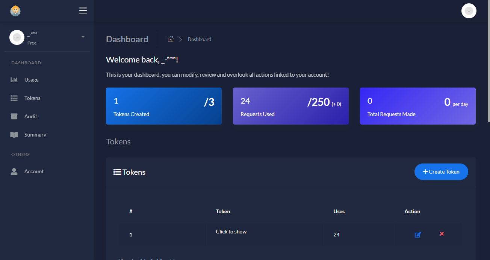
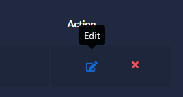
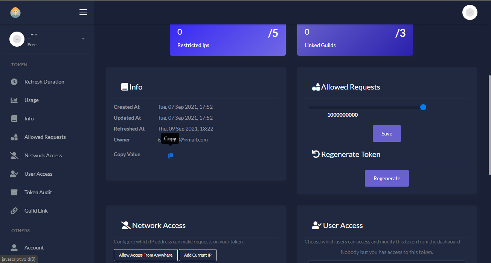

.. meta::
    :title: Documentation - Mecha Karen
    :type: website
    :url: https://docs.mechakaren.xyz/api
    :description: API Reference
    :theme-color: #f54646

***
API
***

Our API is the backbone for many of our great creations including our dashboard, database and discord bot.
Inorder to access our API you will need an ``Access Token``.

.. _HowToGetToken:

Endpoints
=========
.. toctree::
    :maxdepth: 1

    Anime <endpoints/v1/anime>
    Chatbot <endpoints/v1/chatbot>
    Math <endpoints/v1/math/index>
    Image <endpoints/v1/image/index>

..
    The version will always be the latest
    Change when a new version is released

How do I get a Access Token?
============================
Firstly, you need to sign up to our API. If you have already, you can simply login.

Once you have logged in, you will see a screen like:

Click the ``Create Token`` button and it will create you a new token! You can modify your token by clicking:

Same way for deleting a token, you can simply press the red icon.

And thats it you have created your very own token, which you can use for accessing our api!

To copy the value of your token you can click the `Click to show` text from the dashboard or go to the edit page and copy from info as show below:

Making Requests
===============
Inorder to make requests you will need an access token, which can be created from `here <https://api.mechakaren.xyz>`_.
For steps and guidance check out :ref:`HowToGetToken`.

Each request will require your API Token to be included either in the url with they key `authorization` or your headers (Authorzation).
If you surpass your daily requests it will return the time left till the refresh.

Example Request
---------------

.. code-block:: py
    :caption: Endpoint used in this example was the math endpoint

    import requests

    authorization = 'My-API-Token'
    # Make sure to change the above to your token
    to_calculate = '1 plus 1'
    base_url = 'https://api.mechakaren.xyz/v1/math'

    r = requests.get(base_url, params={'authorization': authorization}, json={'equation': to_calculate})
    json = r.json()
    print(json['Results']['Input'], json['Results']['Output'])

Ratelimits
==========
You are allowed to make 2 requests per second. If you surpass this limit a few times, your requests will be raised as a warning. However, continuing to do so will result in a block.

Each token have a limit to many requests are made per day, once you hit this limit it will no longer be able to be used until it has been refreshed.

Ratelimit Example Responses
---------------------------

.. code-block:: json
    :caption: Too many requests in a certain timeframe

    {"code": 429, "error": "You are currently being rate limited ..."}

.. code-block:: json
    :caption: Surpassing allowed requests on a token

    {"code": 429, "error": "You have used up all ... requests on this token"}

Errors
======
Our errors use standard HTTP exception codes and inherit the same meaning/cause, with a description of what actually caused the error attached to them.

+------+-------------------------------+
| Code | Description                   |
+======+===============================+
| 400  | Request data sent by client   |
|      | cannot be interpretted whilst |
|      | being of the correct type     |
+------+-------------------------------+
| 403  | Access to restricted to an    |
|      | endpoint or recourse has been |
|      | blocked due to insufficient   |
|      | permissions                   |
+------+-------------------------------+
| 404  | When a requested recourse has |
|      | been renamed, moved, deleted  |
|      | or just doesn't exist.        |
+------+-------------------------------+
| 405  | Incorrect http method used on |
|      | an endpoint, best way of      |
|      | checking for the correct      |
|      | method is the documentation   |
+------+-------------------------------+
| 429  | Returned when your making too |
|      | many requests in a given time |
|      | frame or you have surpassed   |
|      | the amount of requests you    |
|      | make on a certain endpoint    |
+------+-------------------------------+
| 500  | An error which occured on our |
|      | side, this is not your fault  |
|      | but our's, report us of the   |
|      | issue to help us fix it       |
|      | quicker                       |
+------+-------------------------------+

Example Error Response
----------------------
Generic non `500` error response

.. code-block:: json

    {
        "code": "error-code",
        "error": "cause-of-error",
    }

``500`` Error Response:

.. code-block:: text

    Internal Server Error