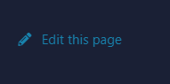

.. Mecha Karen documentation master file, created by
   sphinx-quickstart on Sat May  1 17:20:06 2021.
   You can adapt this file completely to your liking, but it should at least
   contain the root `toctree` directive.

.. meta::
   :title: Documentation - Mecha Karen
   :type: website
   :url: https://docs.mechakaren.xyz/
   :description: Welcome to Mecha Karen's Documentation
   :theme-color: #f54646

Welcome to Mecha Karen's Documentation!
=======================================
Welcome to Mecha Karen's Documentation. This is the place were you can find all the project's documentation for our organization.

If you have any queries - `Click Here`_ to join our support server

.. _Click Here: https://discord.gg/Q5mFhUM

**Note:** Documentation is still W.I.P so many of the recourses are not yet here.

Contents
========

.. toctree::
   :maxdepth: 2

   api/index
   bot/index
   cake/index
   dashboard/index

Indices and tables
==================

* :ref:`search`
* :ref:`genindex`

Errors
======
Errors are something which plague many applications. Even the best of the best experience them. But the more errors we face, the more we patch. It helps us develop a tool everybody love.

We try keep errors to a minimum by testing before pushing to production and taking time with our products.

Bot
---
If you face an error with the bot you will receive a message like:

Documentation
-------------
If there is something wrong in the documentation, you can always click the ``Edit this page`` button which is the right of the page and looks like:

